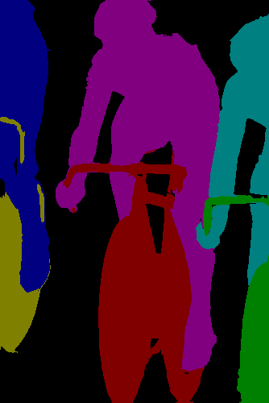

# Contour-Detection-Pytorch
In this work I replicate the [Object Contour Detection with a Fully Convolutional Encoder-Decoder Network](https://arxiv.org/pdf/1603.04530.pdf). The model,data augmentation and training details remain exactly as mentioned in the paper.

## Dataset
As mentioned in the paper, We use DenseCRF refined segmentation maps as the raw labels. These labels are then processed using a 3-3 mask morphing mask to turn them into counter detection target. 

|*Orignal Image* | *Segmantation map* | *Processed label* |
|----------------|--------------------| -----------------|
| |  |  |

```
Run the file extract_contours.py to convert the provided segmentation maps into processed labels. (labels stored in the folder "improved contours" )
```


